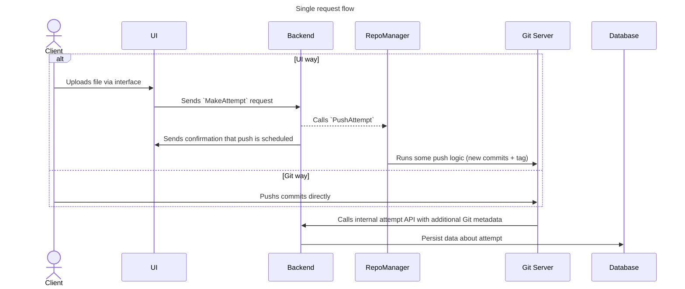

# Attempt API

## Overall description

This API allows to make attempt for course participants.

### Attempt flow

In general, there're two ways to create an attempt:
1. Send files via UI interface (our frontend)
2. Push attempt directly via Git (exact way is not designed yet and implentation is abstraced via `RepoManager` interface).

## Main concepts

### `MakeAttempt` high-level request flow

