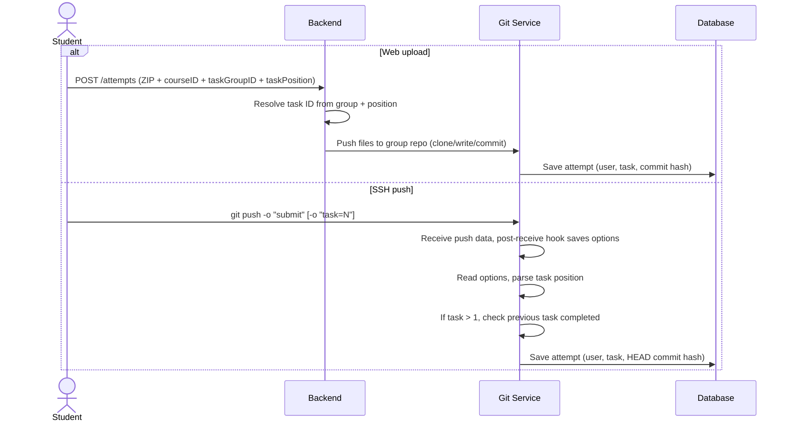

# Attempt API

## Overall description

This API allows course participants to create attempts for tasks within task groups.

### Attempt flow

There are two ways to create an attempt:

1. **Web interface** — upload a ZIP archive with solution files. The backend extracts the files, makes a commit in the group's git repository, and saves the attempt with the commit hash.

2. **SSH git push** — push commits with `-o "submit"` option. After git-receive-pack accepts the data, the push hook saves an attempt referencing the HEAD commit. Optionally specify `-o "task=N"` to target a specific task in the group (defaults to position 1 if the group has exactly one task).

### Sequential validation

If a task group has multiple tasks, submitting to task N requires a submitted attempt on task N-1. This applies to both web and SSH pushes.

### Database structure

An attempt (`attempts` table) links a user to a task (`tasks.id`) and has a chain of state transitions (`attempt_transitions` table). The transition data stores the commit hash from the git repository.

## Push Flow

## Key points

- One git repository per task group per student (all tasks share the same repo).
- Attempts are linked to individual tasks, not to the whole group.
- The commit hash is stored in `attempt_transitions.transition_data` as JSON.
- Both push methods write to the same repository.
