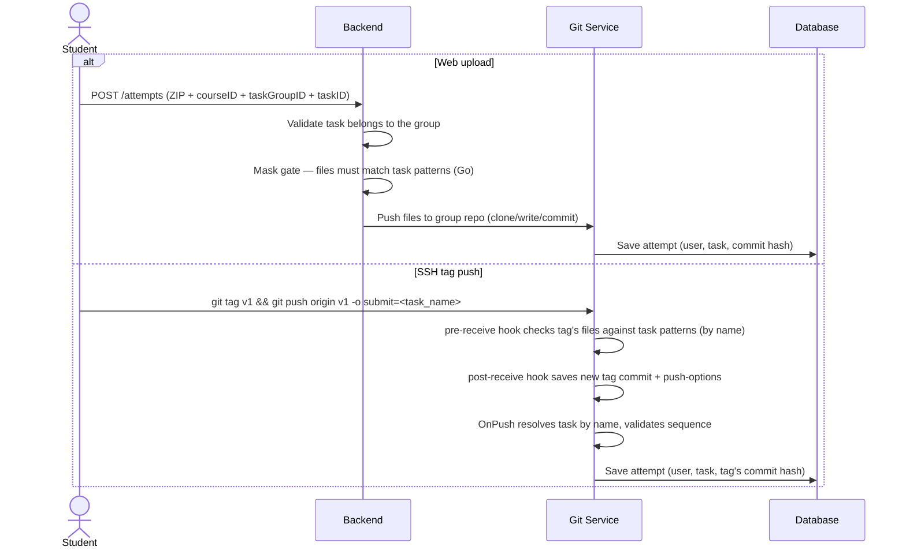

# Attempt API

## Overall description

This API allows course participants to create attempts for tasks within task groups.

### Attempt flow

There are two ways to create an attempt:

1. **Web interface** — upload a ZIP archive with solution files. The backend extracts the files, makes a commit in the group's git repository, and saves the attempt with the commit hash.

2. **SSH git tag push** — create a tag and push it with the `submit` push option naming the task:
   ```
   git tag submission-1 && git push origin submission-1 -o submit=<task_name>
   ```
   The pre-receive hook verifies the tag's commit contains files matching the task's patterns (looked up by task name). If they match, the post-receive hook saves the tag's commit hash and push options. The OnPush hook reads these files, resolves the task by name, and creates an attempt for the tag's commit.

### Mask gate

A task may define file patterns (`tasks.patterns`). A submission is rejected unless at least one of its files matches. For SSH this is enforced by the pre-receive hook (reading the per-repo `.mm-patterns` file); for the web path the same check is duplicated in Go (go-git runs no hooks).

### Database structure

An attempt (`attempts` table) links a user to a task (`tasks.block_id`) and has a chain of state transitions (`attempt_transitions` table). The transition data stores the commit hash from the git repository.

## Push Flow



## Key points

- One git repository per task group per student (all tasks share the same repo).
- Attempts are linked to individual tasks, not to the whole group.
- The commit hash is stored in `attempt_transitions.transition_data` as JSON.
- Both push methods write to the same repository.
- Tag updates (force-push) are rejected by the pre-receive hook.
- Branch pushes never create attempts — only tag pushes with `-o submit=<task_name>` do.
