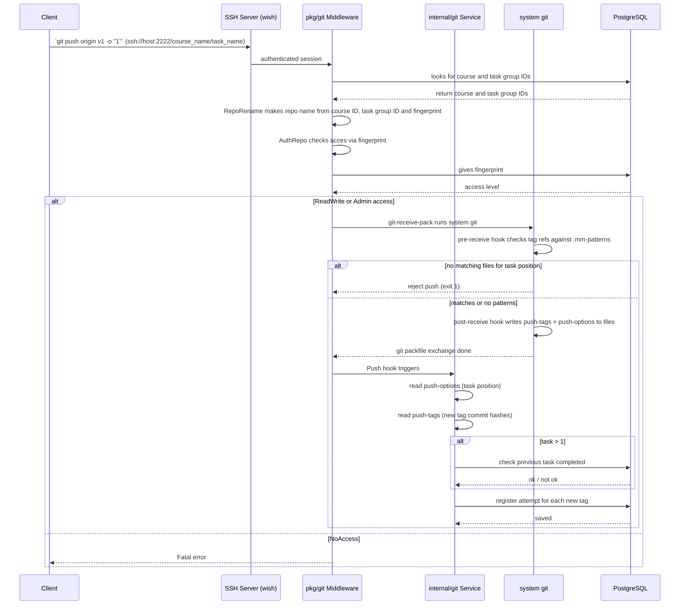
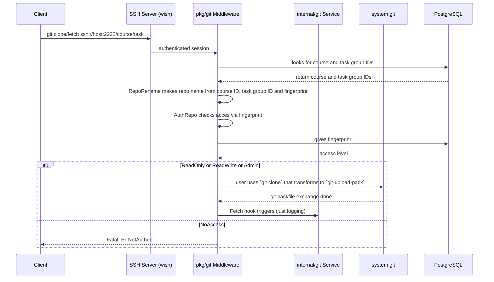

# Git Service — Architecture & User Flow

This API allows participants to work on study projects using the built-in Git server and register attempts.
- **CLI**: `git tag <name> && git push origin <name> -o "<N>"` — tags a commit and submits it as an attempt for task N.
- **Web UI**: participants upload files to create an attempt.

## Push Flow

## Fetch Flow

