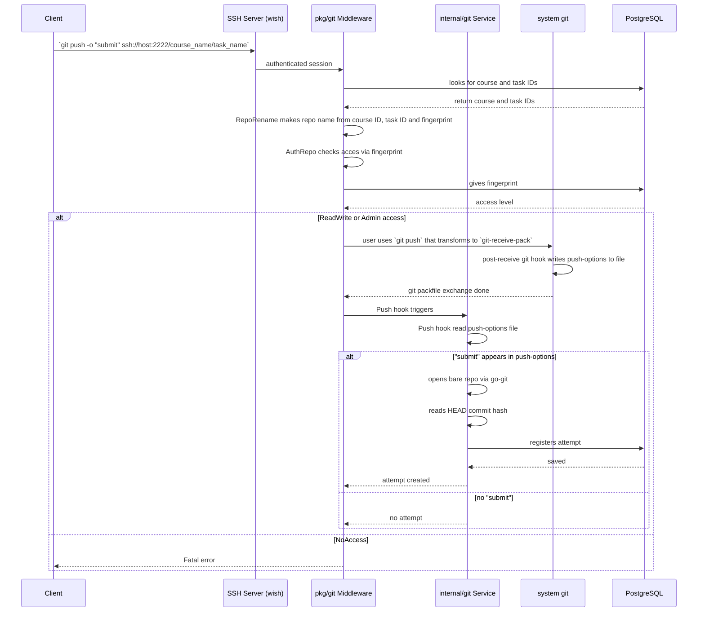
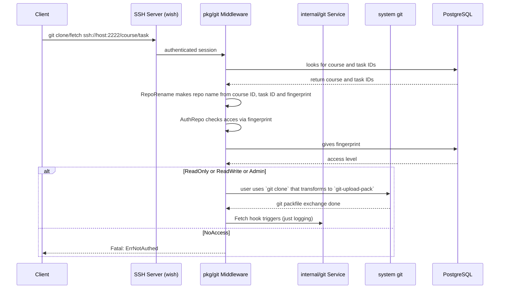

# Git Service — Architecture & User Flow

This API allows participants to work on study projects using the built-in Git server and register attempts.
- **CLI**: `git push -o "submit"` — the last commit becomes an attempt for teacher review.
- **Web UI**: participants upload files to create an attempt.

## Push Flow

## Fetch Flow

