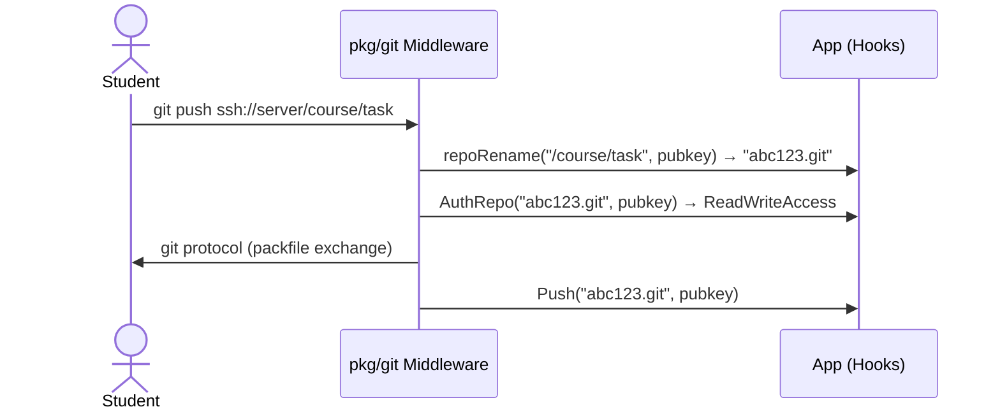
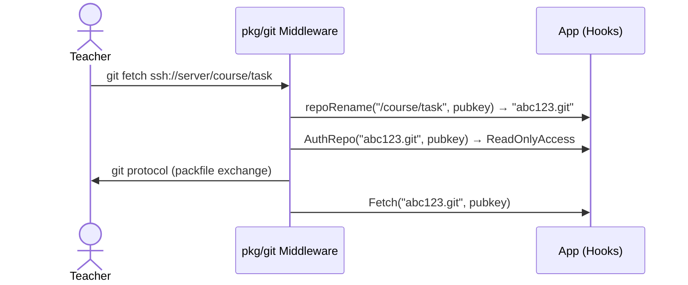

# Git server implementation

## Overall description

This module provides custom SSH server which allows to inject reaction on push/fetch events. You can write implementation of `Hooks` interface and inject it into `Middleware` to get any custom logic you want.

We intend to use `Middleware` with `Hooks` to:
1. Authorize `git-recieve-pack` write access for student (internal part of `git push`).
2. Authorize `git-upload-pack` (internal part of `git fetch`) or `git-upload-archive` (internal part of `git archive`) read access for teacher.

You *may not* understand internal parts of this package and *it's okay* to.

## Use-cases

### git push

### git fetch

